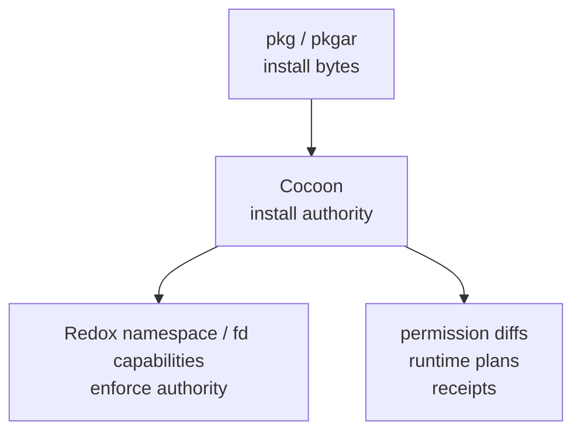

# Cocoon

<p align="center">
  
</p>

<p align="center">
  
  
  
</p>

Capability-aware service capsules on top of Redox package infrastructure.

> Cocoon packages Redox services with typed service authority, strict capsule
> verification, permission diffs, runtime plans, rollback metadata, and audit
> receipts.

Cocoon is not Docker for Redox and not a replacement for `pkg`/`pkgar`. It is a
service deployment layer for long-running or sensitive Redox services.

## Model



```text
pkg/pkgar = payload package layer
Cocoon = service authority layer
Redox namespace/capability = enforcement layer
```

Docker packages a small Linux-shaped world. Cocoon packages a
capability-bound Redox service.

## Non-Negotiable Package-Manager Principle

Cocoon must maximize reuse of the existing RedoxOS package-management stack.
This is a hard design rule, not an optimization or future preference.

- `pkg`/`pkgar` remain the payload package layer: files, content hashes,
  dependencies, repositories, relocatable installation, and normal package
  updates.
- Cocoon must not reimplement dependency solving, package repositories,
  whole-system updates, general app-store workflows, or a competing payload
  package format when a Redox-native package mechanism can be used.
- Cocoon may add only the service-authority layer around that package substrate:
  typed service manifests, permission diffs, runtime plans, install/run receipts,
  rollback metadata, and Redox namespace/fd-capability setup.
- Any feature that needs payload packaging must first ask how to express or
  delegate it through `pkg`/`pkgar`; custom Cocoon payload handling is allowed
  only as a temporary scaffold or compatibility bridge with a clear migration
  path back to Redox package infrastructure.

## Boundary

Cocoon adds service manifests, permission diffs, runtime plans, rollback policy,
and audit receipts on top of Redox package infrastructure.

Cocoon does not do:

- general dependency solving;
- package repositories;
- whole-system updates;
- general app-store workflows;
- OCI compatibility.

It is intended for services such as web consoles, network daemons, logging
daemons, update services, admin panels, device-facing services, and appliance
control services.

## Quick Start

Build, inspect, and verify a capsule:

```bash
cargo run -p cocoon-cli -- build examples/hello-service
cargo run -p cocoon-cli -- inspect target/capsules/hello-service.cocoon
cargo run -p cocoon-cli -- verify target/capsules/hello-service.cocoon
```

P0 capsules are unsigned, so normal verification reports:

```text
Bundle is unsigned (P0 signature placeholder).
```

Strict verification fails unsigned capsules, as intended:

```bash
cargo run -p cocoon-cli -- verify --strict target/capsules/hello-service.cocoon
```

## Permission Diff

Build the demo capsules:

```bash
cargo run -p cocoon-cli -- build examples/permission-diff-v1 \
  --output target/capsules/permission-diff-v1.cocoon
cargo run -p cocoon-cli -- build examples/permission-diff-v2 \
  --output target/capsules/permission-diff-v2.cocoon
```

Compare service authority before an update:

```bash
cargo run -p cocoon-cli -- diff-permissions \
  target/capsules/permission-diff-v1.cocoon \
  target/capsules/permission-diff-v2.cocoon
```

Output:

```text
Authority changes detected:

Added permissions:
      HIGH  allow tcp connect api.example.com:443
    MEDIUM  allow file readwrite /app/cache/**

Modified permissions:
       LOW  allow log read service-log -> allow log write service-log

Removed permissions:
       LOW  allow file read /app/assets/**

Modified schemes:
      HIGH  log readonly target=service-log -> log readwrite target=service-log

Confirmation required: yes
```

## Runtime Plan

Render the normalized runtime contract without executing it:

```bash
cargo run -p cocoon-cli -- plan target/capsules/hello-service.cocoon
```

Example output:

```text
Runtime plan for hello-service@0.1.0
Install root: /pkg/cocoon

Entry:
  cmd: /app/bin/hello-service
  cwd: /app
  args: []

Schemes:
  log readwrite target=service-log

Preopens:
  file /pkg/cocoon/capsules/hello-service/current -> /app [read, execute]

Permissions:
  allow file readwrite /app/**
  allow log write hello-service
  allow time read readonly
  allow rand read readonly
  deny file readwrite /home/**
  deny file readwrite /etc/secrets/**
  deny tcp connect *
  deny device manage /**
```

This is the bridge from P0 capsule intent to future P1 Redox/QEMU execution.

## Redox Smoke Scaffold

Prepare the early P1 smoke artifacts:

```bash
cargo xtask redox-smoke
```

Expected output:

```text
== Host smoke ==
PASS host build cocoon
PASS build hello-service.cocoon
PASS verify capsule
PASS generate runtime plan
PASS image overlay prepared

== Redox target smoke ==
PASS redox link probe cargo check
PASS cocoon-cli redox cargo check
TODO redox link probe binary link (requires Redox C sysroot/toolchain)
TODO cocoon-cli redox binary link (requires Redox C sysroot/toolchain)
```

## Status

P0 defines and verifies capsule intent. It does not yet enforce Redox runtime
isolation. Runtime isolation claims start in P1 with Redox/QEMU evidence:
constructed namespaces, visible schemes, preopened handles, service spawn, log
capture, receipts, and denied-access checks.

## Docs

- [ARCHITECTURE.md](docs/ARCHITECTURE.md)
- [CAPSULE_FORMAT.md](docs/CAPSULE_FORMAT.md)
- [SECURITY_MODEL.md](docs/SECURITY_MODEL.md)
- [ROADMAP.md](docs/ROADMAP.md)
- [CODING_STYLE.md](docs/CODING_STYLE.md)
- [MACOS_DEV.md](docs/MACOS_DEV.md)
- [REDOX_TESTING.md](docs/REDOX_TESTING.md)

## License

MIT
